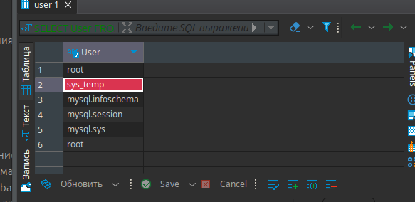
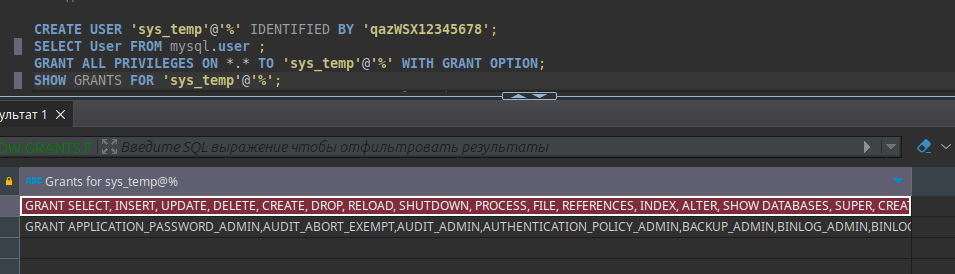
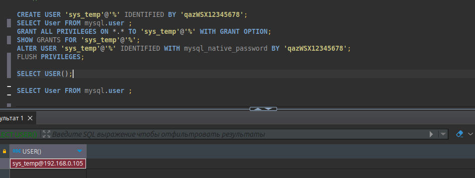
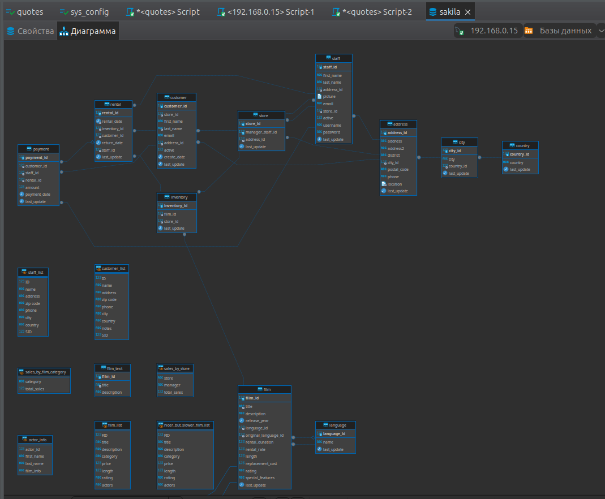
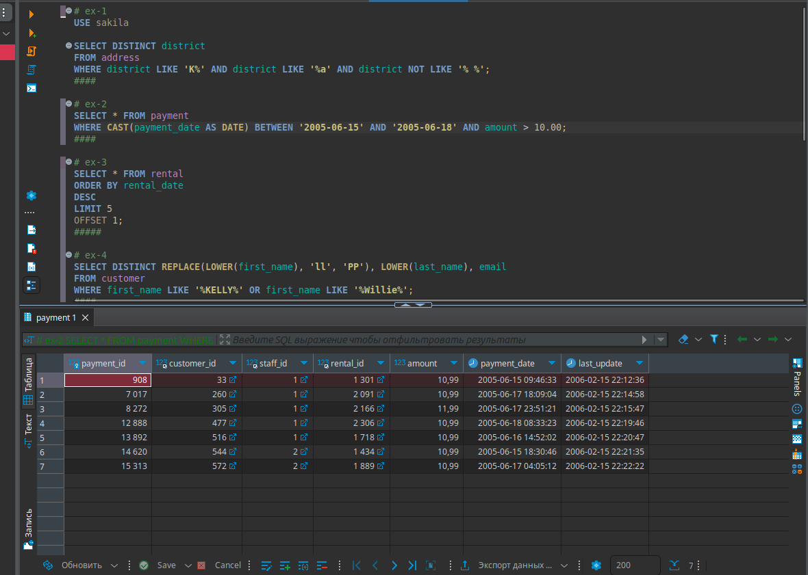
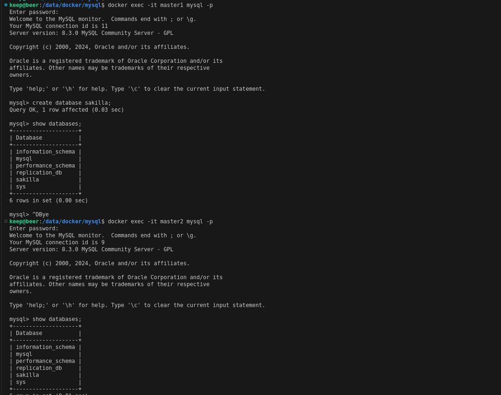
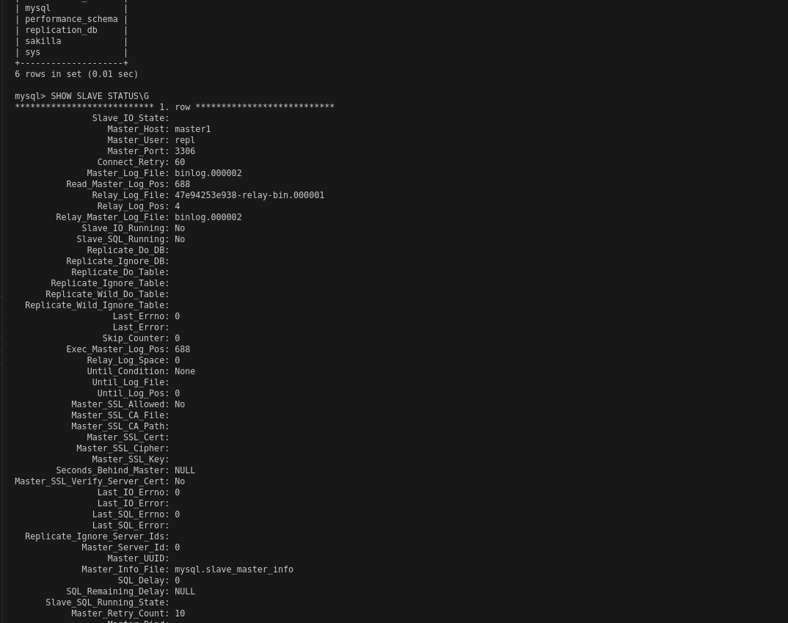

# «SQL-1» - Pirogov A.A.

##     Задание 1 

[Портянка с кодом](./files/sqript.sql)

####	Создаю Пользователя 

####	Дал права пользователю 'sys_temp' 

####	Выполнил подключение к БД с помощью пользователя 'sys_temp'

####	Сформировал ER-диаграмму получившейся базы данных

##     Задание 2

##     Задание 3

