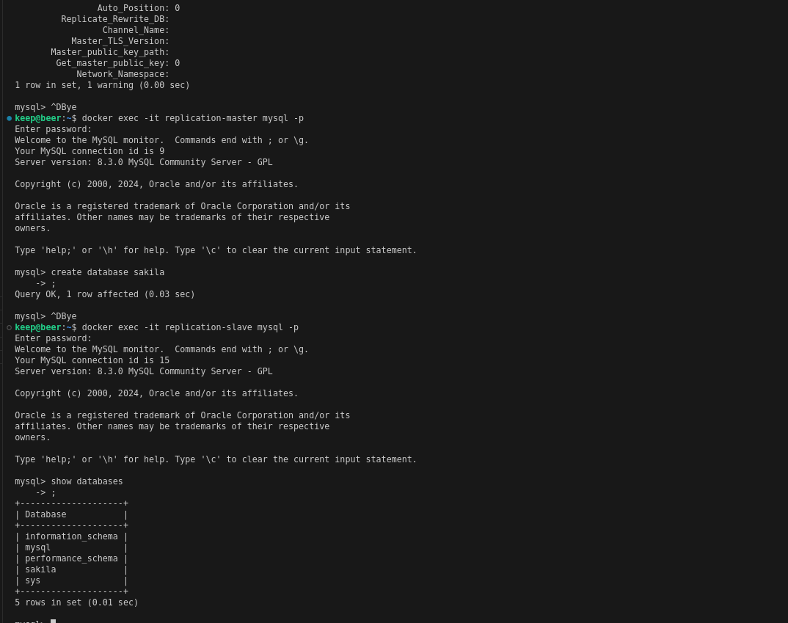

# «Репликация и масштабирование. Часть 1» - Pirogov A.A.

##     Задание 1 

###### Производительность и доступность: 
Master-slave предлагает лучшую производительность для операций чтения, т.к. данные могут быть распределены между несколькими серверами. 
Master-master обеспечивает высокую доступность для операций записи, потому что любая операция может быть обработана на одном из серверов.
###### Сложность управления: 
Master-slave проще в управлении, поскольку требуется только один сервер для обработки операций записи. 
Master-master требует более тщательного планирования и управления, особенно для решения проблем согласованности данных.
###### Отказоустойчивость: 
Master-master обеспечивает более высокий уровень отказоустойчивости, система продолжает работать даже при сбое одного из серверов. 
Master-slave также обеспечивает отказоустойчивость, но в меньшей степени, поскольку все операции записи должны быть выполнены на мастере.

##     Задание 2

##     Задание 3

